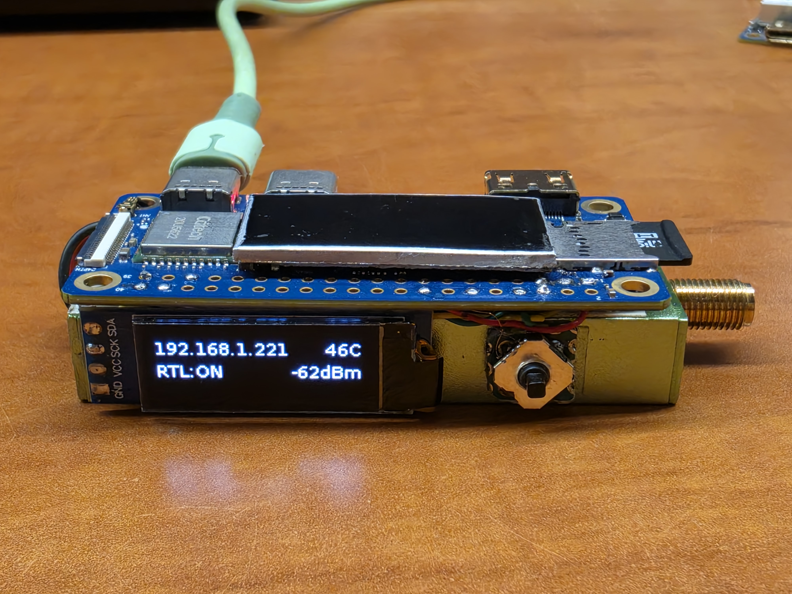
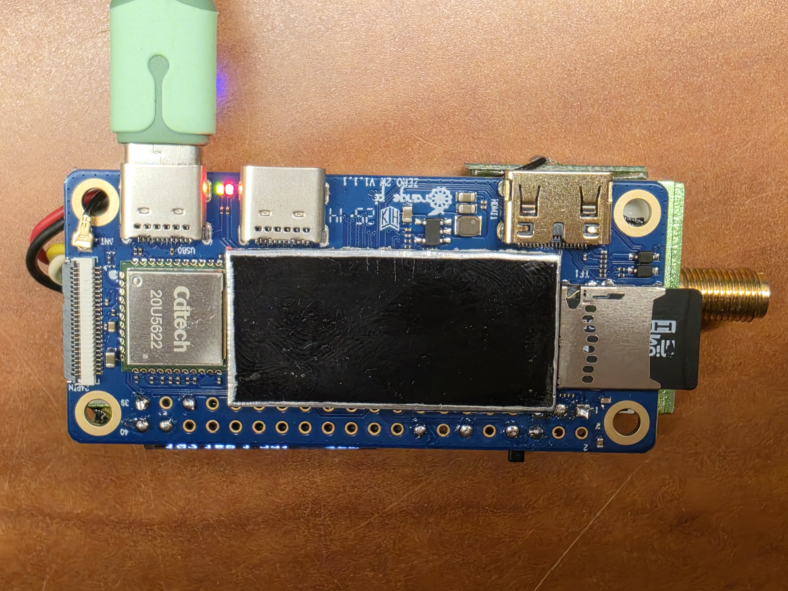
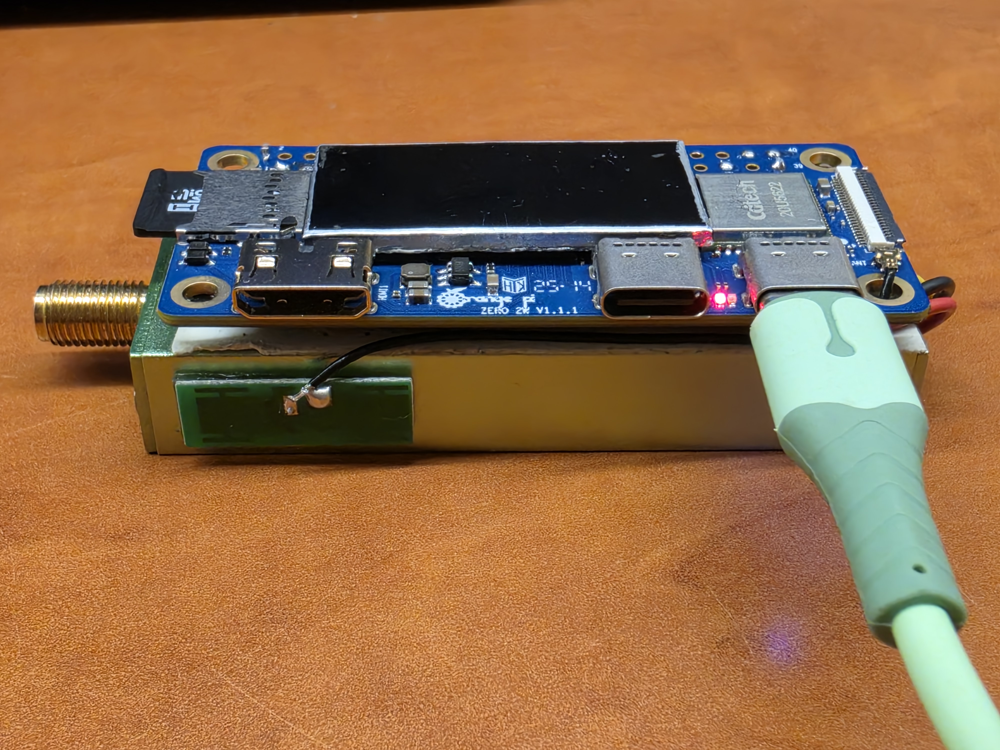
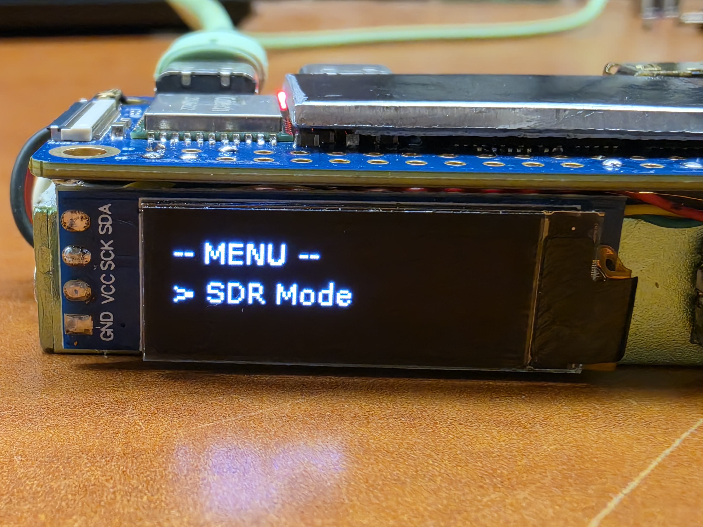
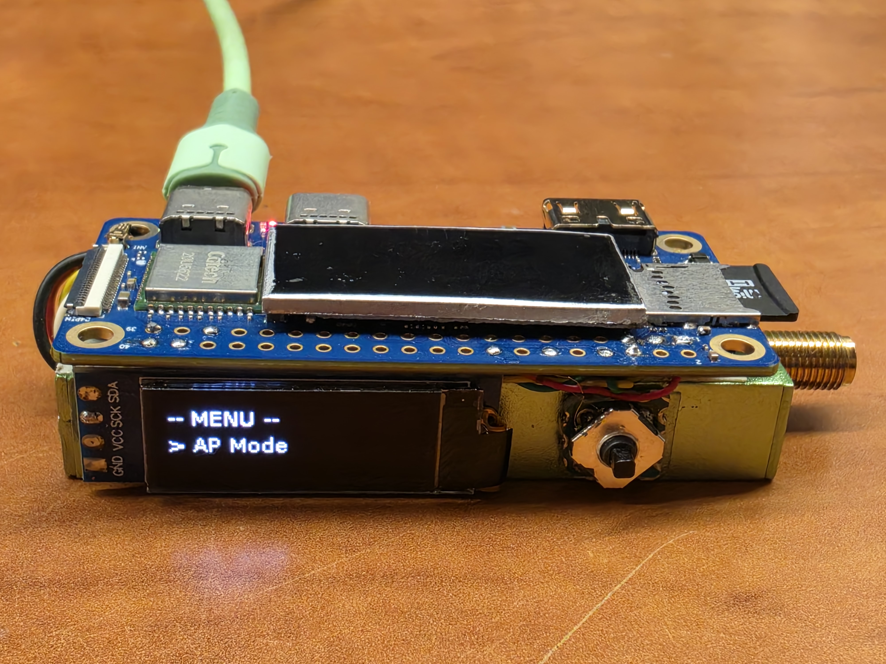
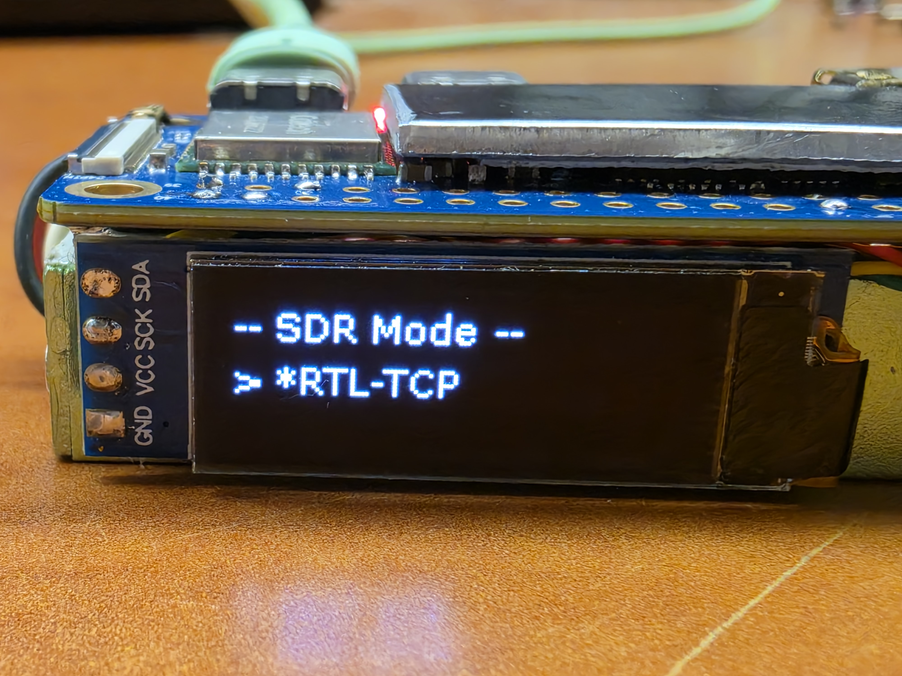
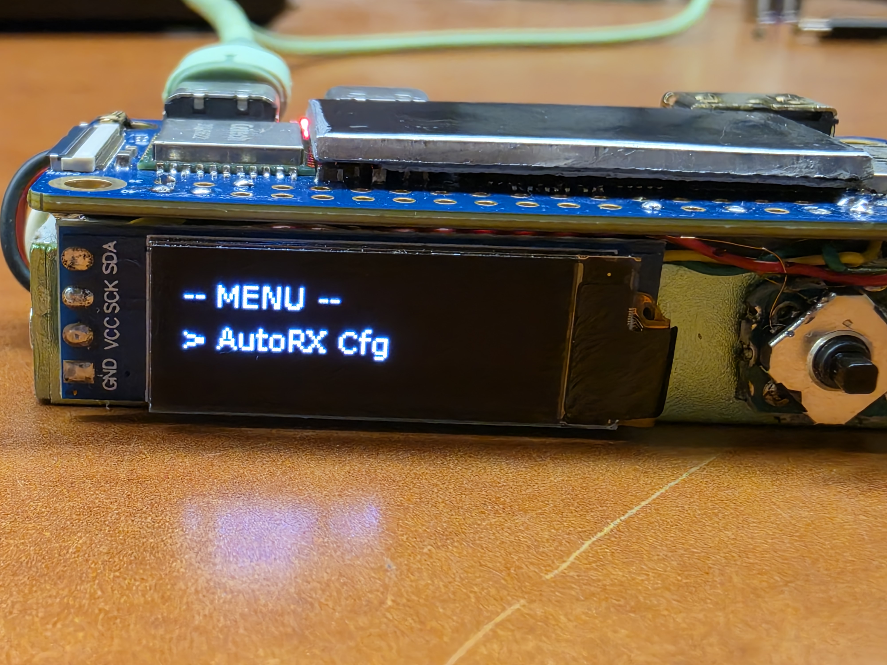

# OrangePi Zero 2W — RTL-SDR MultiTool

A fully standalone **multi-mode SDR server** running on an **Orange Pi Zero 2W**, controlled via a 5-direction digital joystick and a 128×32 OLED display.  
Switch between RTL-TCP, ADS-B, Radiosonde tracking, RTL-433, AIS, and more — all from the device itself, no keyboard or screen required.



---

## Features

| Feature | Details |
|---------|---------|
| **RTL-TCP server** | Start/stop with a button press, real-time frequency display |
| **ADS-B tracking** | readsb decoder + tar1090 web UI |
| **Radiosonde (AutoRX)** | Tracks weather balloons, web UI + OLED station config editor |
| **RTL-433** | 433MHz sensors / IoT devices |
| **AIS** | Ship tracking |
| **POCSAG pagers** | multimon-ng (optional) |
| **128×32 OLED UI** | IP:port, mode status, frequency, CPU temp, RSSI |
| **5-direction joystick** | Navigate menus, switch modes, configure settings |
| **WiFi management** | Connect to saved or new networks via on-screen password entry |
| **5GHz AP mode** | Open hotspot (`OrangePi-SDR`) — browse SDR feeds in the field |
| **Brightness control** | 5 levels, saved across reboots |
| **Power off** | Safe shutdown from the menu |
| **Systemd service** | Auto-starts on boot, restarts on crash |

---

## Hardware

| Component | Details |
|-----------|---------|
| Board | Orange Pi Zero 2W (Allwinner H618, 1GB RAM) |
| OS | Orange Pi OS 1.0.2 (Bookworm, arm64) |
| SDR Dongle | RTL-SDR (any RTL2832U-based) via USB |
| Display | SSD1306 128×32 OLED — I2C bus 2, address `0x3C` |
| Joystick | 5-direction digital joystick (active LOW, internal pull-up) |



### Joystick Wiring

| Joystick Pin | GPIO Pin | Role | Function |
|-------------|----------|------|----------|
| UP | PI1 | BTN_UP | Scroll up / increase value |
| DOWN | PI3 | BTN_DOWN | Scroll down / decrease value |
| LEFT | PI14 | BTN_BACK | Back / Cancel / Delete |
| RIGHT | PI2 | BTN_RIGHT | Toggle RTL-TCP (idle screen) |
| CENTER | PI4 | BTN_SEL | Short: Select — Long (1s): Open menu |
| GND | GND | — | Common ground |

> All joystick pins: active LOW with internal pull-up enabled.

### OLED Wiring (I2C)

| OLED Pin | Orange Pi Pin |
|----------|---------------|
| VCC | 3.3V |
| GND | GND |
| SDA | PI7 (I2C-3 SDA) |
| SCL | PI8 (I2C-3 SCL) |



---

## Quick Install (Fresh SD Card)

### Step 1 — Enable I2C bus

```bash
sudo orangepi-config
# System → Hardware → enable i2c1 → Save → Back
```

Then verify the OLED is detected:

```bash
i2cdetect -y 2
# Should show 0x3C
```

### Step 2 — Clone and run install script

```bash
git clone https://github.com/amir684/orangepi-rtl-sdr.git
cd orangepi-rtl-sdr
bash install.sh
```

The installer will ask which optional components to install — answer Y/N for each.

### Step 3 — Reboot

```bash
sudo reboot
```

The OLED will light up and the service starts automatically on every boot.

---

## Optional Components — Manual Installation

If you want to add a component later, without re-running the full installer:

---

### ADS-B — readsb + tar1090

Tracks aircraft. Web UI at `http://DEVICE_IP/tar1090`

```bash
# Build and install readsb from source (no apt package for arm64)
sudo apt install -y build-essential libusb-1.0-0-dev librtlsdr-dev \
    libprotobuf-c-dev protobuf-c-compiler lighttpd

bash -c "$(wget -nv -O - https://raw.githubusercontent.com/wiedehopf/adsb-scripts/master/readsb-install.sh)"
bash -c "$(wget -nv -O - https://raw.githubusercontent.com/wiedehopf/tar1090/master/install.sh)"

# Disable autostart — button_rtl.py manages start/stop
sudo systemctl disable readsb tar1090
sudo systemctl stop readsb tar1090
```

Configure readsb for RTL-SDR dongle:

```bash
sudo tee /etc/default/readsb > /dev/null <<'EOF'
RECEIVER_OPTIONS="--device-type rtlsdr --device 0"
DECODER_OPTIONS="--max-range 450"
NET_OPTIONS="--net --net-heartbeat 60 --net-ro-size 1000 --net-ro-interval 1 \
--net-ri-port 0 --net-ro-port 30002 --net-sbs-port 30003 \
--net-bi-port 30004,30104 --net-bo-port 30005"
JSON_OPTIONS="--json-location-accuracy 1"
EXTRA_OPTIONS=""
EOF
```

References: [wiedehopf/readsb](https://github.com/wiedehopf/readsb) · [wiedehopf/tar1090](https://github.com/wiedehopf/tar1090)

---

### Radiosonde Auto-RX — Weather balloon tracking

Tracks radiosondes (weather balloons). Web UI at `http://DEVICE_IP:5000`

```bash
# Dependencies
sudo apt install -y python3-numpy python3-scipy python3-requests \
    python3-dateutil tini git
pip3 install --break-system-packages crcmod construct bitarray

# Clone v1.8.2
git clone --depth=1 --branch v1.8.2 \
    https://github.com/projecthorus/radiosonde_auto_rx.git \
    /home/orangepi/radiosonde_auto_rx

# Build decoders (must use build.sh, not just make)
cd /home/orangepi/radiosonde_auto_rx/auto_rx
bash build.sh

# Copy example config
cp station.cfg.example station.cfg
```

Create systemd service:

```bash
sudo tee /lib/systemd/system/auto-rx.service > /dev/null <<'EOF'
[Unit]
Description=Radiosonde Auto-RX
After=network.target

[Service]
ExecStart=/usr/bin/python3 /home/orangepi/radiosonde_auto_rx/auto_rx/auto_rx.py
WorkingDirectory=/home/orangepi/radiosonde_auto_rx/auto_rx
User=orangepi
Restart=on-failure
MemoryMax=256M

[Install]
WantedBy=multi-user.target
EOF

sudo systemctl daemon-reload
sudo systemctl disable auto-rx   # managed by button_rtl.py
```

Set your station coordinates in `station.cfg` — or use the **OLED config editor** (Menu → AutoRX Cfg).

References: [projecthorus/radiosonde_auto_rx](https://github.com/projecthorus/radiosonde_auto_rx)

---

### RTL-433 — 433MHz sensors / IoT

Decodes temperature sensors, weather stations, door sensors, power meters, and hundreds of other 433 MHz devices. HTTP feed at `http://DEVICE_IP:8433`

```bash
sudo apt install -y rtl-433
sudo cp rtl_433.service /lib/systemd/system/rtl_433.service
sudo mkdir -p /var/log/rtl_433
sudo systemctl daemon-reload
sudo systemctl disable rtl_433   # managed by button_rtl.py
```

References: [merbanan/rtl_433](https://github.com/merbanan/rtl_433)

---

### AIS — Ship tracking

`rtl-ais` is **not available** in apt for arm64 Bookworm. Use **AIS-catcher** instead (build takes ~3 min on OrangePi Zero 2W). Web UI at `http://DEVICE_IP:8424`

```bash
sudo apt install -y cmake build-essential librtlsdr-dev libusb-1.0-0-dev \
    pkg-config libssl-dev libz-dev

git clone --depth=1 https://github.com/jvde-github/AIS-catcher.git /tmp/AIS-catcher
cd /tmp/AIS-catcher && mkdir build && cd build
cmake .. -DCMAKE_BUILD_TYPE=Release && make -j2
sudo cp AIS-catcher /usr/local/bin/

cd / && rm -rf /tmp/AIS-catcher

sudo cp ais_catcher.service /lib/systemd/system/ais_catcher.service
sudo systemctl daemon-reload
sudo systemctl disable ais_catcher   # managed by button_rtl.py
```

> **Do NOT use `-d 0`** — it is treated as a serial number, not a device index, and will fail with "cannot find device with SN 0". AIS-catcher picks the first device automatically without the flag.

References: [jvde-github/AIS-catcher](https://github.com/jvde-github/AIS-catcher)

---

### NOAA APT — Satellite images

Receives and decodes live images from NOAA-15, NOAA-18, NOAA-19 weather satellites. Includes automatic pass scheduling and a web image gallery at `http://DEVICE_IP:8080`

```bash
# Dependencies
sudo apt install -y sox python3-ephem wget unzip

# noaa-apt arm64 binary
wget https://github.com/martinber/noaa-apt/releases/download/v1.4.1/noaa-apt-1.4.1-aarch64-linux-gnu-nogui.zip
unzip noaa-apt-1.4.1-aarch64-linux-gnu-nogui.zip
sudo cp noaa-apt-1.4.1-aarch64-linux-gnu-nogui/noaa-apt /usr/local/bin/
sudo chmod +x /usr/local/bin/noaa-apt

# Image output folder
sudo mkdir -p /var/lib/noaa-apt/images
sudo chown orangepi:orangepi /var/lib/noaa-apt/images

# Default config (auto_capture=false — only captures when NOAA mode is active)
sudo tee /etc/noaa_apt.cfg > /dev/null <<'EOF'
{
  "auto_capture": false,
  "min_elev": 15
}
EOF

# Install capture scheduler + web gallery
sudo cp noaa_capture.py /usr/local/bin/noaa_capture.py
sudo cp noaa_web.py     /usr/local/bin/noaa_web.py
sudo cp noaa_capture.service /lib/systemd/system/noaa_capture.service
sudo cp noaa_web.service     /lib/systemd/system/noaa_web.service
sudo systemctl daemon-reload
sudo systemctl enable noaa_web    # gallery always available
sudo systemctl start noaa_web
sudo systemctl disable noaa_capture   # managed by button_rtl.py
```

**How it works:**

1. `noaa_capture.py` downloads fresh TLEs from Celestrak and predicts the next pass for each satellite
2. When a pass starts, it records with `rtl_fm`, converts with `sox`, decodes with `noaa-apt`, saves a PNG — and **deletes the WAV** (WAV files are ~150 MB each)
3. If `auto_capture = false` (default), it only captures when the device is in **NOAA mode** (selected via the SDR menu) — it won't interrupt ADS-B, AutoRX, or RTL-TCP
4. If `auto_capture = true`, it captures every pass regardless of the current mode
5. PNG images are served by `noaa_web.py` — newest first, with next-pass countdown in local time

**Configure from OLED:** Menu → **NOAA Cfg** → toggle Auto Capture / set minimum elevation

References: [martinber/noaa-apt](https://github.com/martinber/noaa-apt) · [Celestrak TLE source](https://celestrak.org/NORAD/elements/gp.php?GROUP=noaa&FORMAT=tle)

---

### multimon-ng — POCSAG pagers

Decodes POCSAG and FLEX pager transmissions. Logs to `/var/log/multimon_ng/pager.log`. Default frequency: 153.350 MHz (common in Israel — adjust in `multimon_ng.service` for your region).

```bash
sudo apt install -y multimon-ng
sudo cp multimon_ng.service /lib/systemd/system/multimon_ng.service
sudo systemctl daemon-reload
sudo systemctl disable multimon_ng   # managed by button_rtl.py
```

References: [EliasOenal/multimon-ng](https://github.com/EliasOenal/multimon-ng)

---

## File Structure

```
Repository:
├── button_rtl.py           Main controller script
├── noaa_capture.py         NOAA APT pass scheduler
├── noaa_web.py             NOAA APT image gallery (HTTP)
├── start_ap.sh             Start hostapd + dnsmasq AP
├── stop_ap.sh              Stop AP and reconnect to WiFi
├── hostapd_5g.conf         5GHz open AP configuration
├── install.sh              One-shot installer with component prompts
├── button_rtl.service      Systemd unit — main controller (auto-start)
├── auto-rx.service         Systemd unit — AutoRX (managed)
├── rtl_433.service         Systemd unit — RTL-433 (managed)
├── ais_catcher.service     Systemd unit — AIS-catcher (managed)
├── noaa_capture.service    Systemd unit — NOAA scheduler (managed)
├── noaa_web.service        Systemd unit — NOAA gallery (auto-start)
├── multimon_ng.service     Systemd unit — pager decoder (managed)
├── INSTALL_NOTES.md        Hard-won installation knowledge
└── images/                 Project photos

Installed on device:
/usr/local/bin/
├── button_rtl.py
├── noaa_capture.py
├── noaa_web.py
├── start_ap.sh
└── stop_ap.sh
/etc/hostapd/hostapd_5g.conf
/etc/noaa_apt.cfg              (NOAA config: auto_capture, min_elev)
/etc/button_rtl_brightness     (brightness level, auto-created)
/var/lib/noaa-apt/images/      (decoded PNG satellite images)
/var/log/rtl_433/events.json   (RTL-433 decoded events)
/var/log/multimon_ng/pager.log (multimon-ng decoded messages)
/tmp/sdr_mode                  (current mode, read by noaa_capture.py)
```

---

## Usage

### Idle Screen

The idle screen scrolls the IP address with port/path so you always know the exact URL to connect to.


```
192.168.1.221:1234     46C
RTL: ON             -62dBm
```

Line 1: IP + port/path (scrolls if too long) · CPU temp fixed on right  
Line 2: Active mode status · RSSI / aircraft count on right

| Mode | Line 1 address | Line 2 right |
|------|---------------|-------------|
| RTL-TCP | `IP:1234` | RSSI |
| AutoRX | `IP:5000` | Sonde count |
| ADS-B | `IP/tar1090` | Aircraft count |
| RTL-433 | `IP:8433` | Last decoded model |
| AIS | `IP:8424` | Ships seen |
| NOAA APT | `IP:8080` | Next pass countdown |
| Pager | `IP 153.35M` | Last decoded message |
| SDR Off | `IP` | — |

| Button | Action |
|--------|--------|
| BTN_UP | Toggle RTL-TCP ON / OFF |
| BTN_RIGHT | Toggle RTL-TCP ON / OFF |
| BTN_SEL (hold 1s) | Open main menu |

---

### Main Menu

Hold center button for 1 second from the idle screen to open the menu.

  


| Item | Action |
|------|--------|
| SDR Mode | Switch between RTL-TCP / AutoRX / ADS-B / RTL-433 / AIS / NOAA APT / Pager / Off |
| AutoRX Cfg | Edit station coordinates and callsign on OLED |
| NOAA Cfg | Toggle auto-capture and set minimum pass elevation |
| AP Mode | Start 5GHz hotspot |
| Stop AP | Stop hotspot, reconnect to WiFi |
| WiFi Mode | Connect to saved or new WiFi network |
| Brightness | Adjust OLED brightness (5 levels) |
| Power Off | Safe shutdown |
| < Back | Return to idle |

Navigation: **UP/DOWN** scroll · **SEL** confirm · **BACK** cancel

---

### SDR Mode Selection



```
-- SDR Mode --
> *RTL-TCP
```

`*` marks the currently active mode. Selecting a mode stops all running SDR services and starts the chosen one. The dongle is exclusive — only one mode runs at a time.

| Mode | What it does | Web access |
|------|-------------|------------|
| RTL-TCP | Raw IQ stream for SDR clients | `DEVICE_IP:1234` |
| AutoRX | Radiosonde tracking | `http://DEVICE_IP:5000` |
| ADS-B | Aircraft tracking | `http://DEVICE_IP/tar1090` |
| RTL-433 | 433MHz sensor decoding | `http://DEVICE_IP:8433` |
| AIS | Ship tracking | `http://DEVICE_IP:8424` |
| NOAA APT | Satellite image capture | `http://DEVICE_IP:8080` |
| Pager | POCSAG/FLEX decoder | log: `/var/log/multimon_ng/pager.log` |
| SDR Off | Stop all SDR activity | — |

Only installed modes appear in the menu.

---

### AutoRX Station Config Editor

Edit your station's GPS coordinates and callsign directly from the OLED — no SSH needed.



Menu → **AutoRX Cfg** → choose field:

**Latitude / Longitude / Altitude:**

```
Lat:+32.0853
    ─
^v:val  <>:pos  OK
```

| Button | Action |
|--------|--------|
| UP / DOWN | Change the digit under the cursor |
| RIGHT | Move cursor right |
| BACK | Move cursor left (or exit without saving) |
| SEL | Save and return |

**Callsign:**

```
Callsign:
TA4ABC[D]
```

| Button | Action |
|--------|--------|
| UP / DOWN | Cycle through characters (A-Z, 0-9, /) |
| SEL | Add current character |
| BACK | Delete last character (or exit if empty) |
| SEL on `<OK>` | Save and return |

Saved to: `/home/orangepi/radiosonde_auto_rx/auto_rx/station.cfg`

---

### Brightness Control

Menu → **Brightness**

```
Brightness
████░  4/5
```

| Button | Action |
|--------|--------|
| UP | Increase brightness |
| DOWN | Decrease brightness |
| SEL | Back to menu |

5 levels (1 = very dim, 5 = max). Saved to `/etc/button_rtl_brightness`, restored on reboot.

---

### AP Mode

Starts a 5GHz open hotspot — useful in the field when there's no WiFi.

```
192.168.100.1          51C
AP RTL: ON
```

- SSID: `OrangePi-SDR` (no password)
- DHCP: `192.168.100.10 – 192.168.100.50`
- RTL-TCP: `192.168.100.1:1234`
- ADS-B web UI: `http://192.168.100.1/tar1090`
- AutoRX web UI: `http://192.168.100.1:5000`

To stop: Menu → **Stop AP** (reconnects to last WiFi).

> Change `country_code=IL` in `hostapd_5g.conf` if you're not in Israel.

---

### WiFi Password Entry

On-screen character picker for joining new networks:

| Button | Action |
|--------|--------|
| UP / DOWN | Cycle through characters |
| SEL (short) | Add current character |
| BACK | Delete last character |
| SEL (hold 1s) | Connect with entered password |

Minimum password length: 8 characters.

---

## Connecting SDR Software

| Setting | Value |
|---------|-------|
| Host | Pi IP (shown on OLED) |
| Port | `1234` |
| Protocol | RTL-TCP |

Works with **SDR#**, **GQRX**, **SDR++**, and any `rtl_tcp`-compatible client.

---

## Service Management

```bash
# Check status
sudo systemctl status button_rtl

# Restart
sudo systemctl restart button_rtl

# View live logs
journalctl -u button_rtl -f

# Check AutoRX
sudo systemctl status auto-rx
journalctl -u auto-rx -f

# Check ADS-B
sudo systemctl status readsb
```

---

## Troubleshooting

| Problem | Fix |
|---------|-----|
| OLED not detected | Run `i2cdetect -y 2` — must show `0x3C`. Enable I2C in `orangepi-config` |
| `usb_claim_interface error -6` | Another process holds the dongle — handled automatically by the script |
| AutoRX `dft_detect does not exist` | Run `bash build.sh` (not `make`) inside `auto_rx/` |
| ADS-B "Device busy" on first start | RTL-TCP was running — switch mode via menu to release dongle |
| tar1090 not loading | Port is **80** at `/tar1090` — not 8080 or 8504 |
| AutoRX showing wrong map location | Edit station.cfg via OLED menu (Menu → AutoRX Cfg) |
| AIS "cannot find device with SN 0" | Do not use `-d 0` with AIS-catcher — it is a serial number, not device index |
| NOAA "No satellites loaded" | Check TLE names in code use space not dash: `"NOAA 15"` not `"NOAA-15"` |
| NOAA capture never runs | Check `auto_capture` in `/etc/noaa_apt.cfg` — or switch to NOAA mode via menu |
| Button not responding | Only `PI`-prefix GPIO pins work on this board — `PH` pins fail with EINVAL |

---

## SSH Access

```bash
ssh orangepi@<IP>
# Recommended: key auth
ssh -i ~/.ssh/orangepi_key orangepi@<IP>
```
